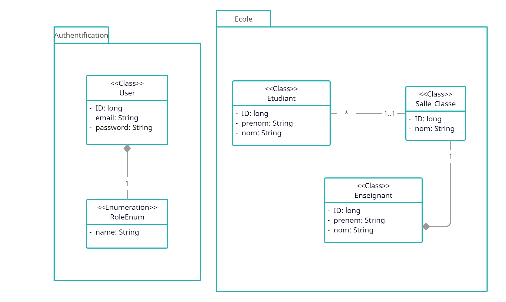

# alex_kouasseu_2sdh34rfm
Test de développement Java Spring Anywr (Spring Boot, Spring Security, Spring Data JPA, API Restfull)

## Stack et outils utilisés
- Outil de construction : **Maven**
- Language et version : **Java 17**
- Spring boot version : **3.1.0** 
- Sécurisation des API REST : **Token JWT via Spring Security**
- SGBD : **H2**
- ORM: **Hibernate**
- Migration de données : **Liquibase**

# Structure de la base de données
La structure de notre base de données sera comme suit, pour pemettre une certaine évolutivité de l'application et d'avoir un couplage faible entre nos entités

Outils utilisé: [Creately](https://app.creately.com/)

# Sécurisation de nos API par un Token JWT avec Spring Security
Le Schéma suiviant inspiré de celui qu'on peut trouver sur le site [Aliboucoding.com](https://aliboucoding.com/p/securing-your-spring-boot-3-0-applications-with-json-web-tokens-jwt) présente comment nos API seront sécurisées par un token JWT

# Quelques informations utiles

## BD

## Construction et Démarrage de l'application

## API Docs

## Variable D'environnement
- **DB_URL** : Url de la base de données
- **DB_USERNAME** : Nom d'utilisateur de la base de données
- **DB_PASSWORD** : Password de l'utilisateur de la base de données
- **LIQUIBASE_ENABLE** : Activer ou non la prise en charge de Liquibase. (true, false)
- **LIQUIBASE_DROOP_FIRST** : Indique s'il faut d'abord supprimer le schéma de la base de données (true, false)